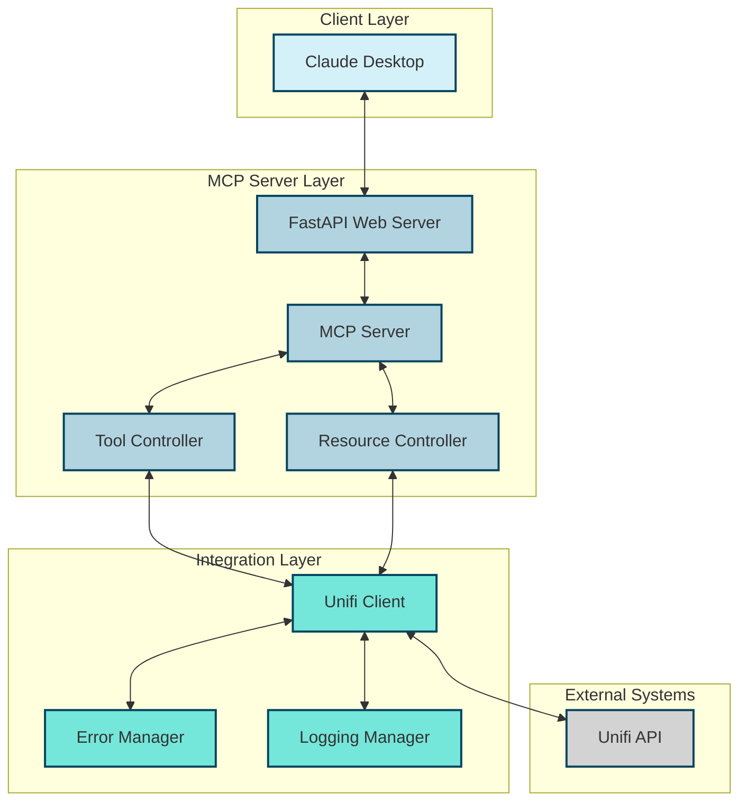
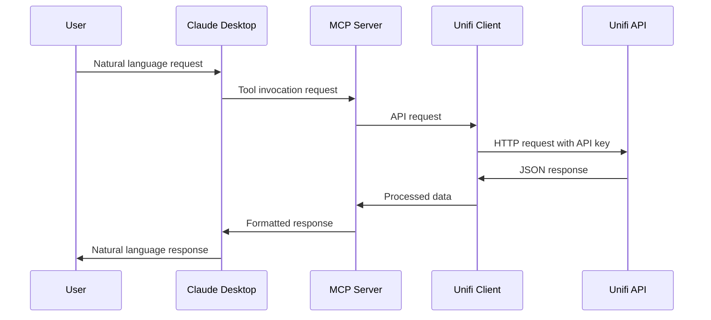
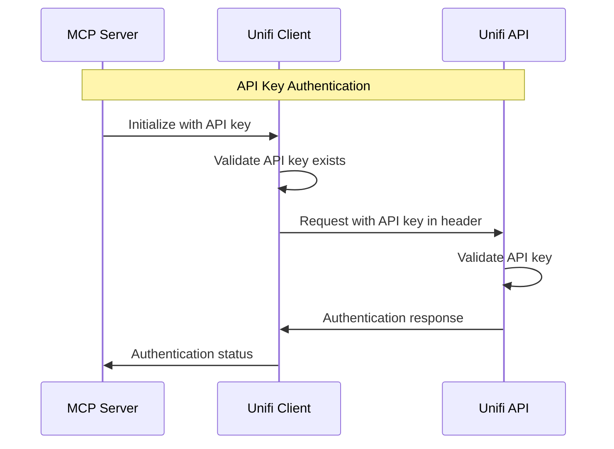
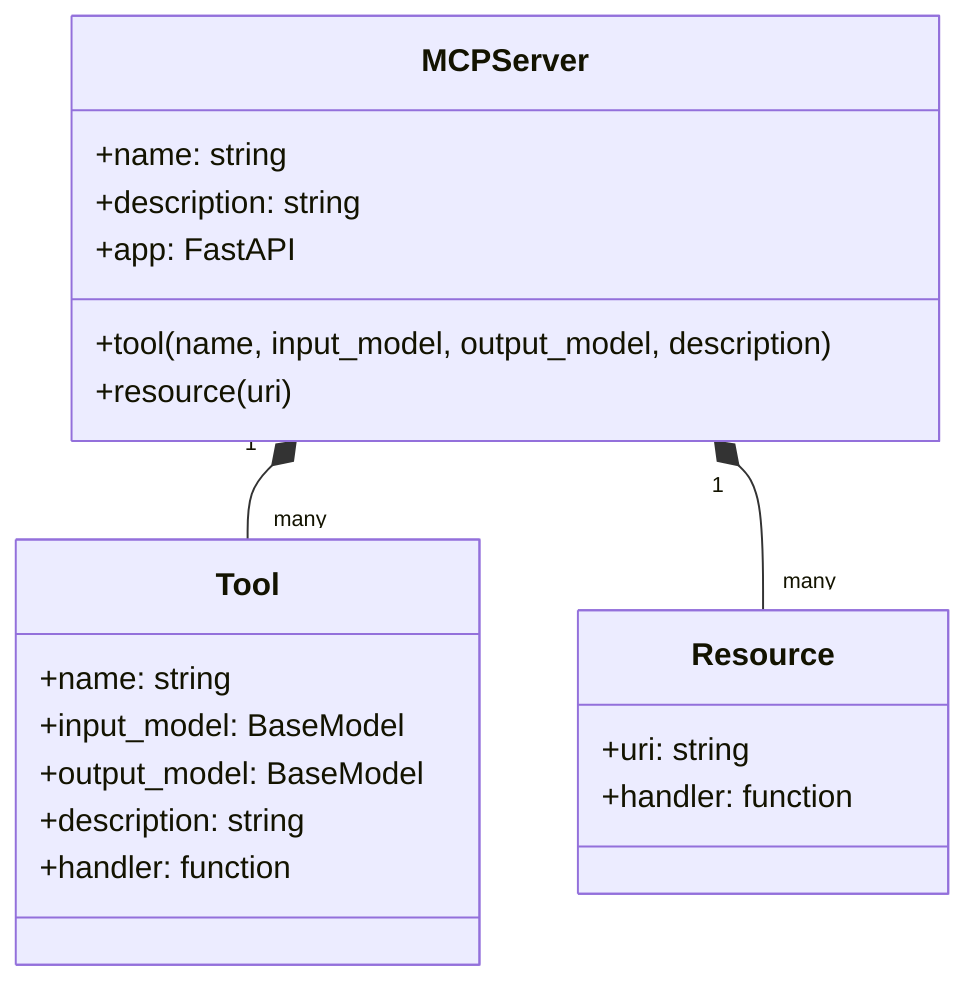
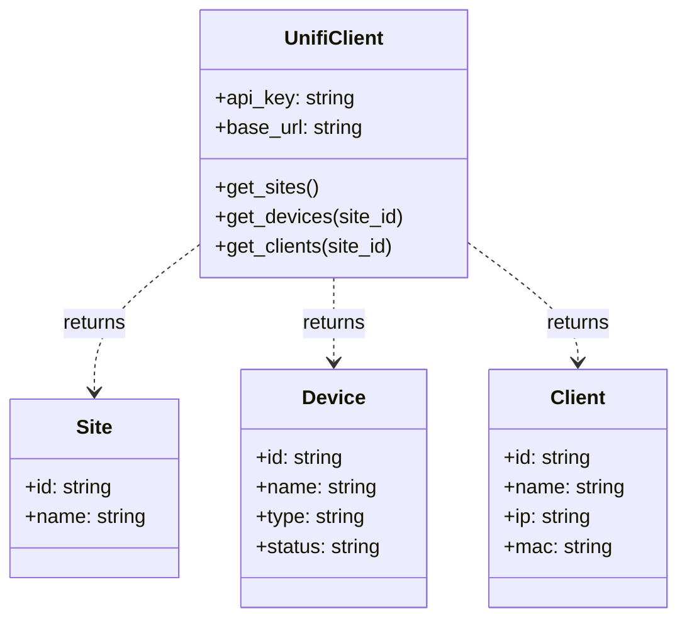
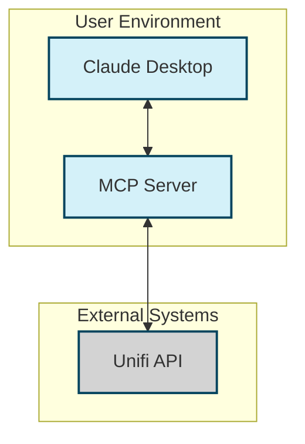
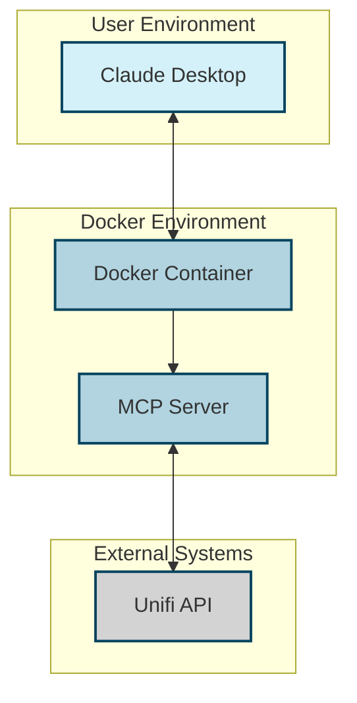
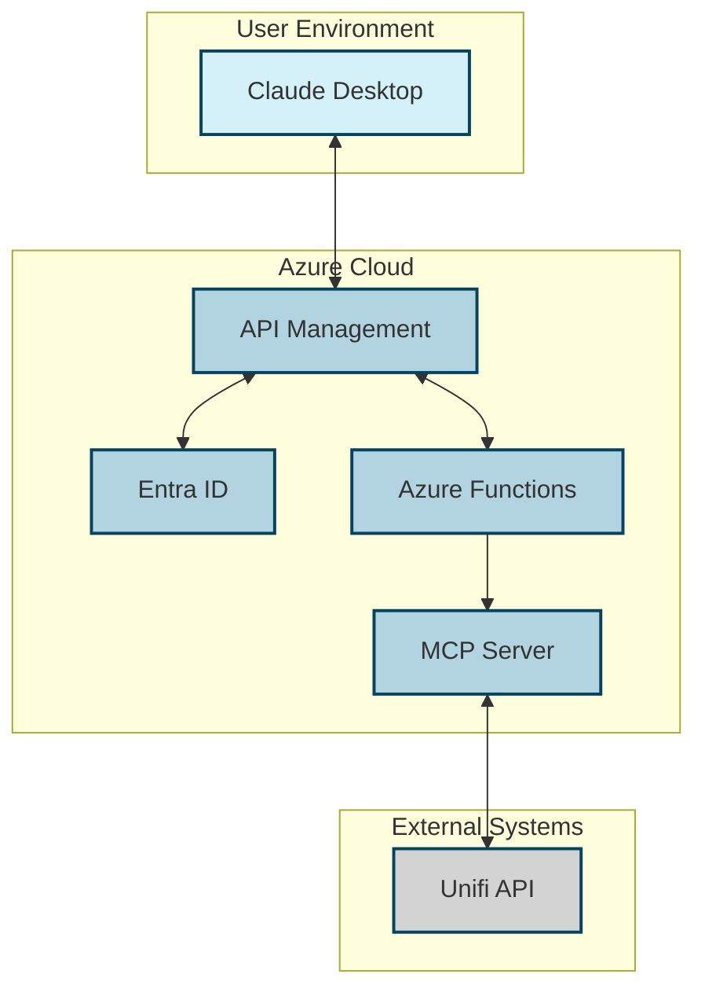
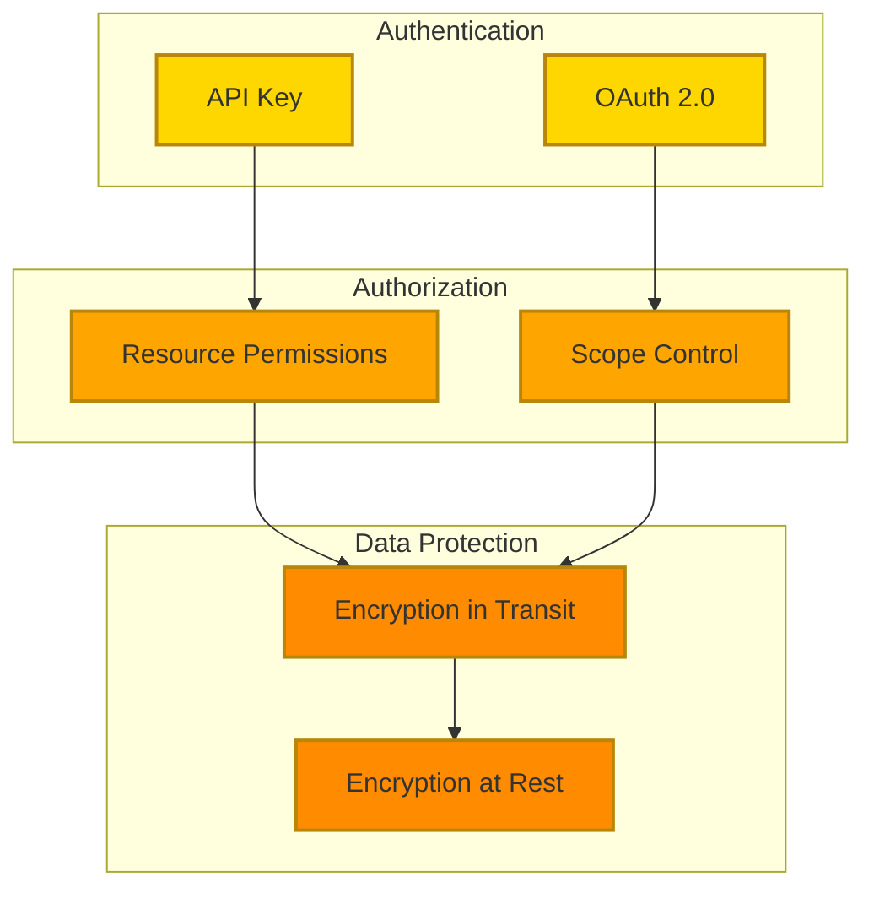
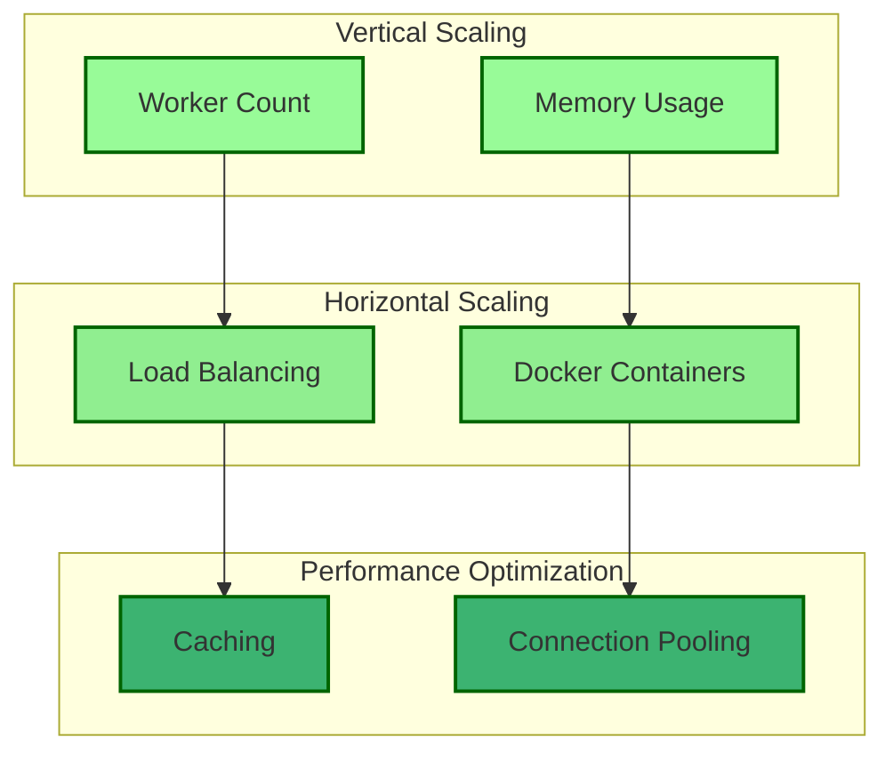

# Unifi MCP Server Architecture

## System Overview

The Unifi MCP Server architecture enables natural language interaction with Unifi network infrastructure through Claude Desktop by implementing the Model Context Protocol (MCP). This document outlines the system's components, interactions, data flows, and deployment considerations.

## Architecture Principles

1. **Separation of Concerns**: Clear boundaries between components with well-defined responsibilities
2. **API-First Design**: RESTful interfaces for all components
3. **Security by Design**: Secure authentication and data handling throughout
4. **Scalability**: Components designed to scale independently
5. **Extensibility**: Easy addition of new tools and capabilities

## Component Architecture

### Component Descriptions

#### Client Layer

- **Claude Desktop**: AI assistant that interacts with users via natural language and communicates with the MCP Server

#### MCP Server Layer

- **MCP Server**: Core component implementing the Model Context Protocol
- **FastAPI Web Server**: Handles HTTP requests and responses
- **Tool Controller**: Manages MCP tools (get_sites, get_devices, get_clients)
- **Resource Controller**: Manages MCP resources (unifi://sites)

#### Integration Layer

- **Unifi Client**: Handles communication with the Unifi Site Manager API
- **Error Manager**: Handles and standardizes error responses
- **Logging Manager**: Manages logging throughout the system

#### External Systems

- **Unifi API**: External Unifi Site Manager API

## Data Flow Architecture

### Primary Data Flows

### Authentication Flow

## Detailed Component Design

### MCP Server Component

### Unifi Client Component

## API Design

### MCP Tools API

| Tool Name | Description | Input | Output |
|-----------|-------------|-------|--------|
| `get_sites` | Get a list of all Unifi sites | None | List of sites with IDs and names |
| `get_devices` | Get a list of devices for a specific site | Site ID | List of devices with details |
| `get_clients` | Get a list of clients for a specific site | Site ID | List of clients with details |

### MCP Resources API

| Resource URI | Description | Output |
|--------------|-------------|--------|
| `unifi://sites` | Resource for accessing Unifi sites | List of sites with IDs and names |

### REST API Endpoints

| Endpoint | Method | Description |
|----------|--------|-------------|
| `/docs` | GET | OpenAPI documentation |
| `/openapi.json` | GET | OpenAPI specification |
| `/mcp/tools` | GET | List of available MCP tools |
| `/mcp/tools/{tool_name}` | POST | Execute an MCP tool |
| `/mcp/resources/{resource_uri}` | GET | Access an MCP resource |

## Deployment Architecture

### Standard Deployment

### Docker Deployment

### Enterprise Deployment with OAuth

## Security Architecture

### Authentication and Authorization

### Security Considerations

1. **API Key Protection**:
   - Store API keys securely in environment variables
   - Rotate keys regularly
   - Use the principle of least privilege

2. **Transport Security**:
   - Use HTTPS for all communications
   - Implement proper certificate validation

3. **Error Handling**:
   - Sanitize error messages to prevent information leakage
   - Log detailed errors internally but return generic messages to clients

4. **Enterprise Security**:
   - Implement OAuth 2.0 with Azure API Management and Entra ID
   - Use token-based authentication with short-lived tokens
   - Implement proper scope control

## Scalability and Performance

### Scalability Considerations

### Performance Considerations

1. **Caching**:
   - Implement caching for frequently accessed data
   - Use time-based cache invalidation

2. **Connection Pooling**:
   - Reuse HTTP connections to the Unifi API
   - Implement proper connection timeout handling

3. **Asynchronous Processing**:
   - Use async/await for I/O-bound operations
   - Implement proper error handling for async operations

4. **Worker Configuration**:
   - Adjust the number of workers based on system resources
   - Monitor worker performance and adjust as needed

## Extension Points

The architecture is designed to be extensible in the following ways:

1. **Additional MCP Tools**:
   - Add new tools to support more Unifi API functionality
   - Implement tools for specific use cases (e.g., network troubleshooting)

2. **Additional MCP Resources**:
   - Add new resources to provide more data to Claude Desktop
   - Implement resources for specific data types (e.g., network statistics)

3. **Integration with Other Systems**:
   - Extend the architecture to support other network management systems
   - Implement adapters for different API formats

4. **Enhanced Security**:
   - Add support for additional authentication methods
   - Implement more granular authorization controls

## Architecture Decision Records

### ADR-1: Use of FastAPI for Web Framework

**Context**: We need a web framework to handle HTTP requests and responses.

**Decision**: Use FastAPI as the web framework.

**Rationale**:
- FastAPI provides automatic OpenAPI documentation
- It has built-in support for Pydantic models
- It supports asynchronous request handling
- It has good performance characteristics

**Consequences**:
- Requires Python 3.6+ (we're using 3.8+)
- Adds a dependency on Pydantic for data validation

### ADR-2: Use of Environment Variables for Configuration

**Context**: We need a way to configure the server without hardcoding values.

**Decision**: Use environment variables for configuration, with support for .env files.

**Rationale**:
- Environment variables are a standard way to configure applications
- They can be set in different ways (shell, .env file, Docker)
- They don't require code changes to update

**Consequences**:
- Requires documentation of available environment variables
- Requires handling of missing or invalid environment variables

### ADR-3: Docker Support

**Context**: We need a way to deploy the server in different environments.

**Decision**: Provide Docker support with a Dockerfile and docker-compose.yml.

**Rationale**:
- Docker provides a consistent deployment environment
- It simplifies dependency management
- It makes it easier to deploy in different environments

**Consequences**:
- Requires Docker knowledge to use
- Adds complexity to the deployment process
- Requires proper volume mapping for logs

## Conclusion

The Unifi MCP Server architecture provides a robust, secure, and extensible foundation for integrating Unifi network infrastructure with Claude Desktop. By implementing the Model Context Protocol, it enables natural language interaction with Unifi systems, making network management more accessible and intuitive.

The architecture is designed to be deployed in various environments, from a simple local installation to a more complex enterprise deployment with OAuth authentication. It provides clear separation of concerns, well-defined interfaces, and extension points for future enhancements.
