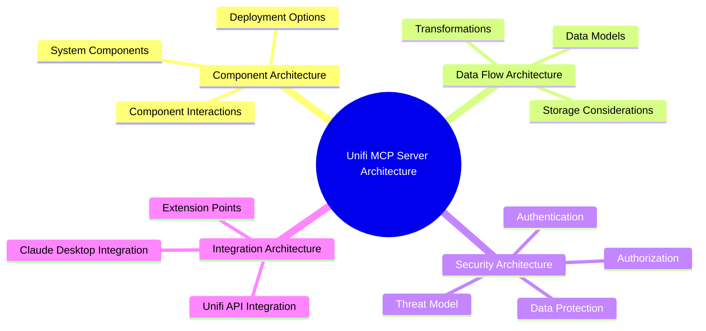
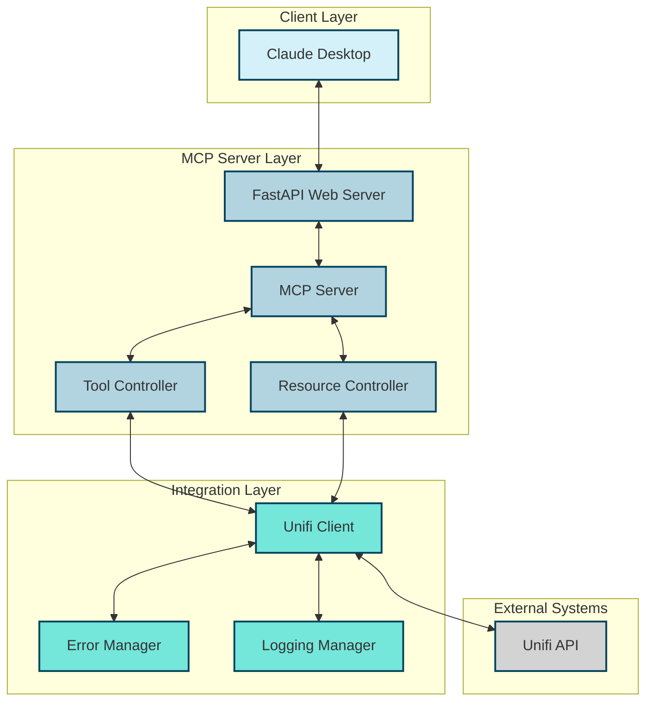
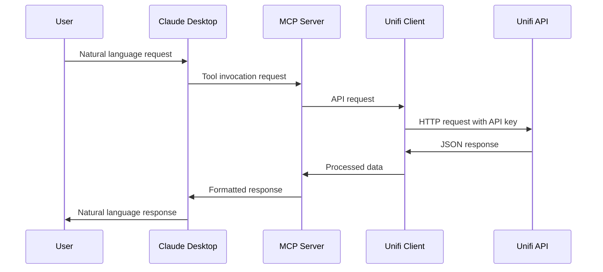
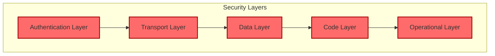
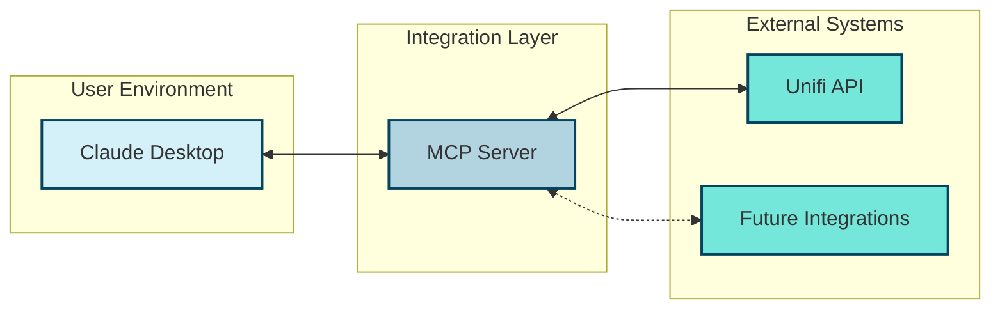
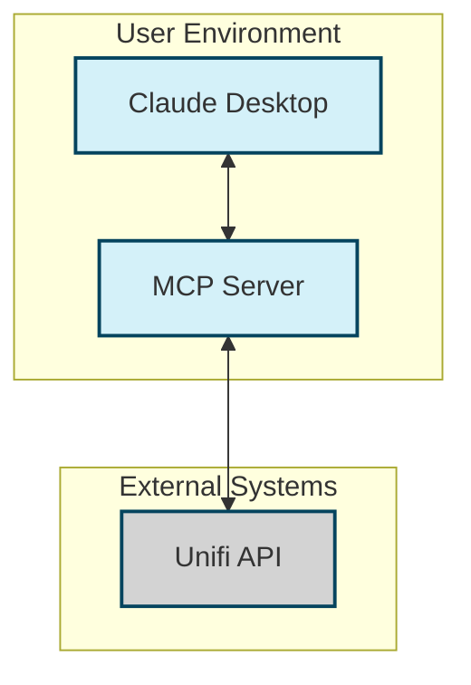
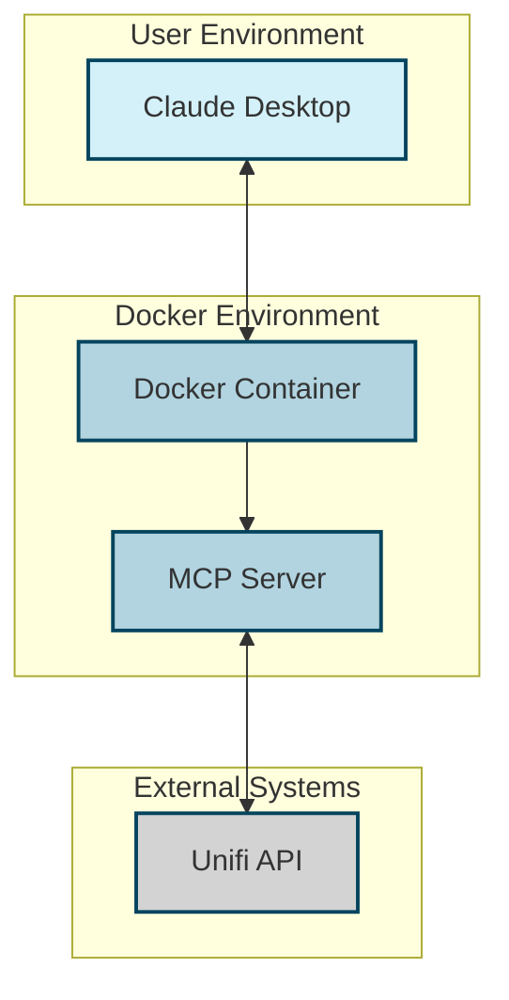
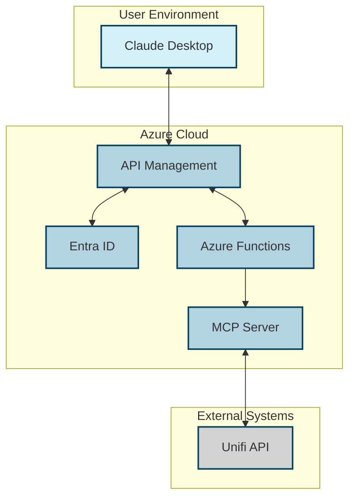

# Unifi MCP Server Architecture Documentation

## Overview

This document serves as the central index for the Unifi MCP Server architecture documentation. It provides an overview of the architectural design and links to detailed documentation on specific aspects of the architecture.

The Unifi MCP Server is a Model Context Protocol (MCP) server that integrates with the Unifi Site Manager API, allowing users to interact with their Unifi network infrastructure using natural language through Claude Desktop.

## Architecture Documentation Map

## Core Architecture Documents

| Document | Description | Key Sections |
|----------|-------------|--------------|
| [Architecture Overview](architecture.md) | Comprehensive overview of the system architecture | Component Architecture, Deployment Architecture, Security Architecture |
| [Data Flow Architecture](data_flow_architecture.md) | Detailed documentation of data flows within the system | Data Models, Data Transformations, Data Storage |
| [Security Architecture](security_architecture.md) | Security aspects of the system | Authentication, Data Protection, Threat Model |
| [Integration Architecture](integration_architecture.md) | Integration with external systems | Claude Desktop Integration, Unifi API Integration |

## Component Architecture

The Unifi MCP Server consists of several key components that work together to provide the functionality:

For detailed information on the component architecture, see the [Architecture Overview](architecture.md) document.

## Data Flow Architecture

The data flow architecture describes how data moves through the system, from natural language requests to API calls and back:

For detailed information on the data flow architecture, see the [Data Flow Architecture](data_flow_architecture.md) document.

## Security Architecture

The security architecture addresses authentication, authorization, data protection, and threat modeling:

For detailed information on the security architecture, see the [Security Architecture](security_architecture.md) document.

## Integration Architecture

The integration architecture describes how the MCP server integrates with Claude Desktop and the Unifi API:

For detailed information on the integration architecture, see the [Integration Architecture](integration_architecture.md) document.

## Deployment Architecture

The Unifi MCP Server can be deployed in various configurations:

### Standard Deployment

### Docker Deployment

### Enterprise Deployment

For detailed information on deployment options, see the [Architecture Overview](architecture.md) document.

## Architecture Decision Records

The architecture is based on several key decisions:

1. **Use of FastAPI**: FastAPI was chosen as the web framework for its automatic OpenAPI documentation, built-in support for Pydantic models, and asynchronous request handling.

2. **Environment Variables for Configuration**: Environment variables were chosen for configuration to avoid hardcoding values and to support different deployment environments.

3. **Docker Support**: Docker support was added to provide a consistent deployment environment and simplify dependency management.

For detailed information on architecture decisions, see the [Architecture Overview](architecture.md#architecture-decision-records) section.

## Extension Points

The architecture is designed to be extensible in several ways:

1. **Additional MCP Tools**: New tools can be added to support more Unifi API functionality.

2. **Additional MCP Resources**: New resources can be added to provide more data to Claude Desktop.

3. **Integration with Other Systems**: The architecture can be extended to support other systems beyond Unifi.

For detailed information on extension points, see the [Integration Architecture](integration_architecture.md#integration-extensibility) section.

## Future Architecture Considerations

Future enhancements to the architecture may include:

1. **Enhanced Authentication**: OAuth integration and multi-factor authentication.

2. **Caching**: Implementation of caching for frequently accessed data.

3. **Event-Driven Architecture**: Support for real-time updates based on events from the Unifi system.

4. **Scalability Enhancements**: Additional measures to improve scalability for larger deployments.

For detailed information on future considerations, see the respective sections in the architecture documents.

## Related Documentation

- [Project Overview](1_overview_project.md)
- [Installation and Setup](2_installation_setup.md)
- [Configuration Guide](3_configuration_guide.md)
- [Usage Guide](4_usage_guide.md)
- [API Reference](5_api_reference.md)
- [Docker Deployment](6_docker_deployment.md)
- [Troubleshooting Guide](7_troubleshooting_guide.md)
- [Maintenance and Updates](8_maintenance_updates.md)