# Unifi MCP Server Data Flow Architecture

This document details the data flows within the Unifi MCP Server, including data models, transformations, and integration points.

## Data Flow Overview

The Unifi MCP Server acts as a bridge between Claude Desktop and the Unifi Site Manager API, transforming natural language requests into structured API calls and converting API responses into user-friendly formats.

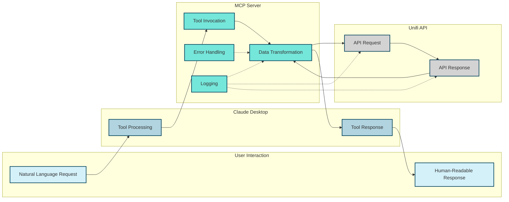

## Data Models

### Input Data Models

These models define the structure of data coming into the MCP Server from Claude Desktop.

#### GetSitesInput

```python
class GetSitesInput(BaseModel):
    pass  # No input parameters required
```

#### GetDevicesInput

```python
class GetDevicesInput(BaseModel):
    site_id: str = Field(..., description="ID of the site to get devices for")
```

#### GetClientsInput

```python
class GetClientsInput(BaseModel):
    site_id: str = Field(..., description="ID of the site to get clients for")
```

### Output Data Models

These models define the structure of data going out from the MCP Server to Claude Desktop.

#### GetSitesOutput

```python
class GetSitesOutput(BaseModel):
    sites: List[Dict[str, Any]] = Field(..., description="List of Unifi sites")
```

Example:
```json
{
  "sites": [
    {
      "id": "site1",
      "name": "Main Office"
    },
    {
      "id": "site2",
      "name": "Branch Office"
    }
  ]
}
```

#### GetDevicesOutput

```python
class GetDevicesOutput(BaseModel):
    devices: List[Dict[str, Any]] = Field(
        ...,
        description="List of devices for the specified site"
    )
```

Example:
```json
{
  "devices": [
    {
      "id": "device1",
      "name": "AP-Office",
      "type": "UAP-AC-Pro",
      "status": "connected"
    },
    {
      "id": "device2",
      "name": "Switch-Main",
      "type": "USW-Pro-24-PoE",
      "status": "connected"
    }
  ]
}
```

#### GetClientsOutput

```python
class GetClientsOutput(BaseModel):
    clients: List[Dict[str, Any]] = Field(
        ...,
        description="List of clients for the specified site"
    )
```

Example:
```json
{
  "clients": [
    {
      "id": "client1",
      "name": "Laptop-1",
      "ip": "192.168.1.100",
      "mac": "00:11:22:33:44:55"
    },
    {
      "id": "client2",
      "name": "Phone-1",
      "ip": "192.168.1.101",
      "mac": "AA:BB:CC:DD:EE:FF"
    }
  ]
}
```

### Unifi API Data Models

These models represent the data structures used by the Unifi Site Manager API.

#### Site

```json
{
  "id": "string",
  "name": "string",
  "description": "string",
  "role": "string",
  "status": "string"
}
```

#### Device

```json
{
  "id": "string",
  "name": "string",
  "type": "string",
  "model": "string",
  "mac": "string",
  "ip": "string",
  "status": "string",
  "uptime": "number",
  "last_seen": "string",
  "firmware_version": "string"
}
```

#### Client

```json
{
  "id": "string",
  "name": "string",
  "mac": "string",
  "ip": "string",
  "hostname": "string",
  "os_name": "string",
  "device_type": "string",
  "is_wired": "boolean",
  "last_seen": "string",
  "uptime": "number",
  "signal_strength": "number"
}
```

## Data Transformations

### Natural Language to Tool Invocation

Claude Desktop transforms natural language requests into structured tool invocations:

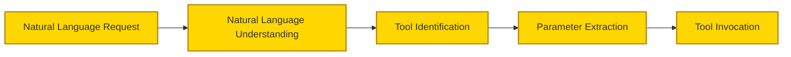

Example:
```
Natural Language: "Show me all devices at my Main Office site"

Tool Invocation: {
  "tool": "get_devices",
  "parameters": {
    "site_id": "site1"
  }
}
```

### Tool Invocation to API Request

The MCP Server transforms tool invocations into Unifi API requests:

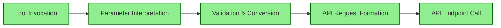

Example:
```
Tool Invocation: {
  "tool": "get_devices",
  "parameters": {
    "site_id": "site1"
  }
}

API Request:
GET https://api.ui.com/sites/site1/devices
Headers: {
  "Authorization": "Bearer unifi_api_key",
  "Content-Type": "application/json"
}
```

### API Response to Tool Response

The MCP Server transforms Unifi API responses into tool responses:

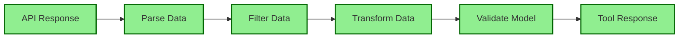

Example:
```
API Response:
[
  {
    "id": "device1",
    "name": "AP-Office",
    "type": "UAP-AC-Pro",
    "model": "UAP-AC-Pro",
    "mac": "00:11:22:33:44:55",
    "ip": "192.168.1.10",
    "status": "connected",
    "uptime": 1234567,
    "last_seen": "2023-01-01T00:00:00Z",
    "firmware_version": "5.60.9"
  },
  ...
]

Tool Response:
{
  "devices": [
    {
      "id": "device1",
      "name": "AP-Office",
      "type": "UAP-AC-Pro",
      "status": "connected"
    },
    ...
  ]
}
```

### Tool Response to Natural Language

Claude Desktop transforms tool responses into natural language responses:

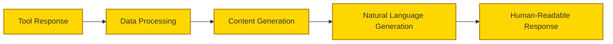

Example:
```
Tool Response:
{
  "devices": [
    {
      "id": "device1",
      "name": "AP-Office",
      "type": "UAP-AC-Pro",
      "status": "connected"
    },
    {
      "id": "device2",
      "name": "Switch-Main",
      "type": "USW-Pro-24-PoE",
      "status": "connected"
    }
  ]
}

Human-Readable Response:
"I found 2 devices at your Main Office site:

1. AP-Office (UAP-AC-Pro) - Status: connected
2. Switch-Main (USW-Pro-24-PoE) - Status: connected

All devices are currently connected and operational."
```

## Data Flow Sequences

### Get Sites Sequence

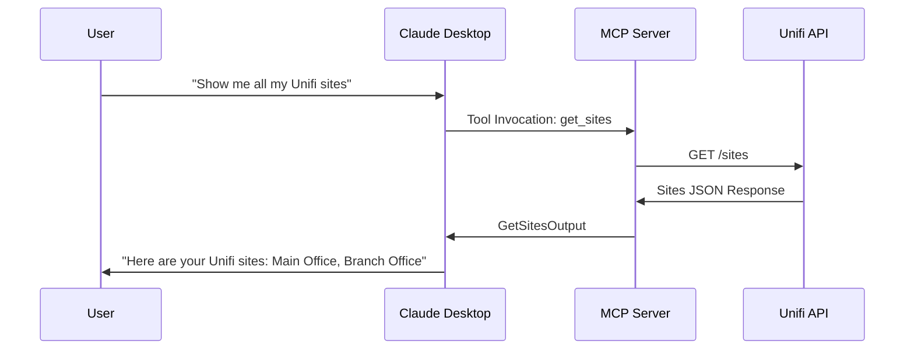

### Get Devices Sequence

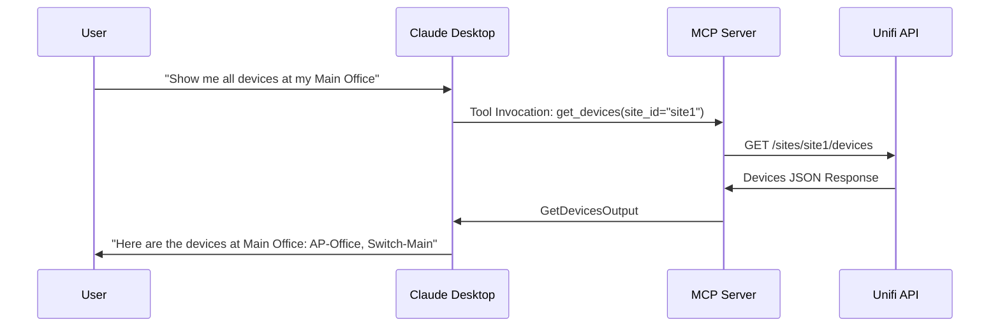

### Get Clients Sequence

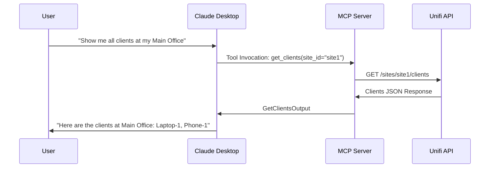

## Error Handling Data Flow

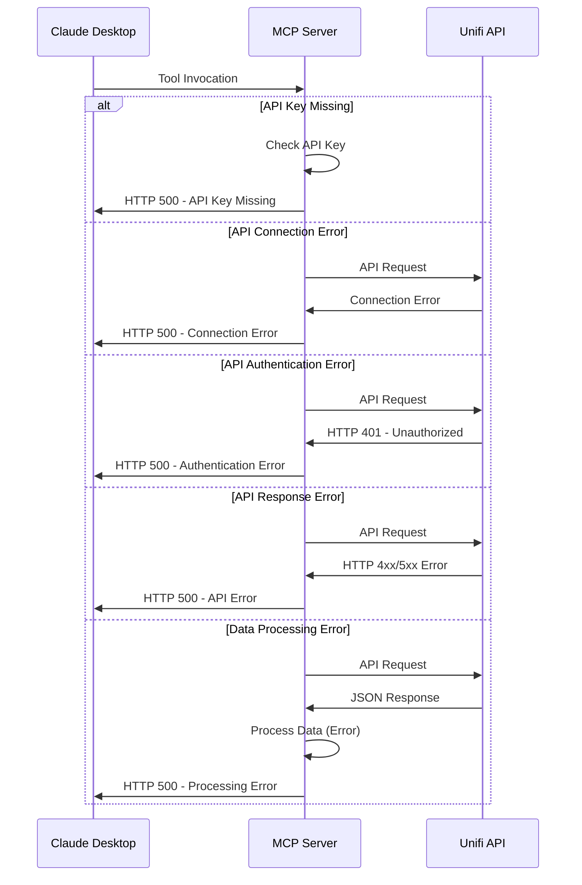

## Logging Data Flow

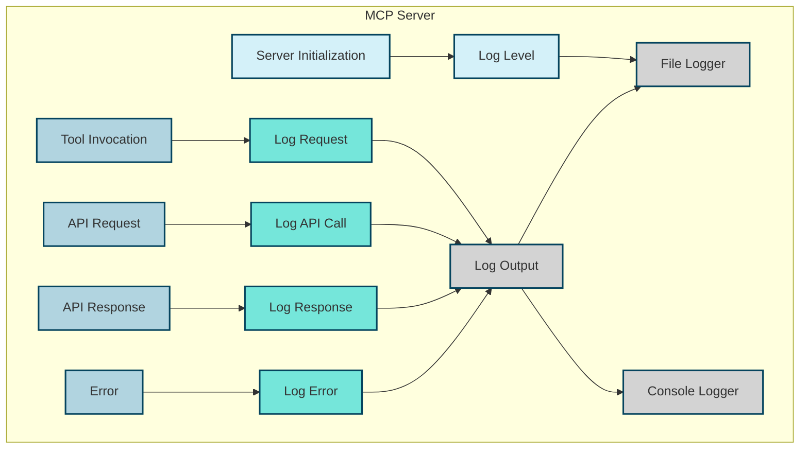

## Data Storage Considerations

The Unifi MCP Server is primarily stateless, with no persistent data storage requirements. However, there are some considerations for ephemeral data:

### Logging

- **Console Logging**: Default logging to console
- **File Logging**: Optional logging to files
- **Docker Volume**: When using Docker, logs can be persisted using volumes

### Environment Variables

- **`.env` File**: Stores configuration like API keys
- **Environment Variables**: Can be set directly in the environment
- **Docker Environment**: Set via docker-compose.yml or command line

### Caching Considerations (Future Enhancement)

While not implemented in the current version, future enhancements could include caching:

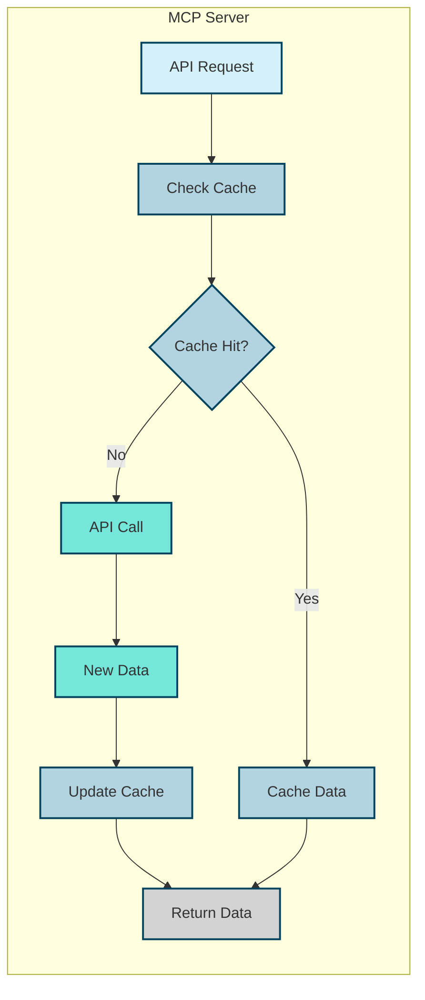

## Integration Points

### Claude Desktop Integration

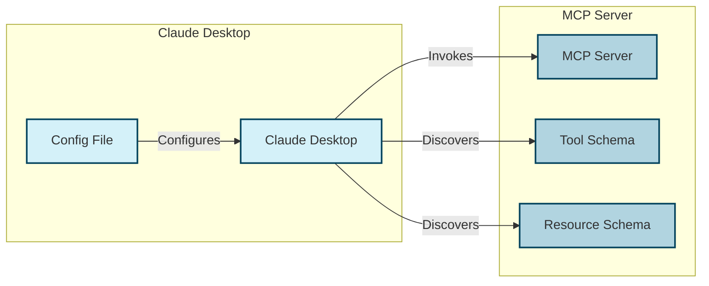

### Unifi API Integration

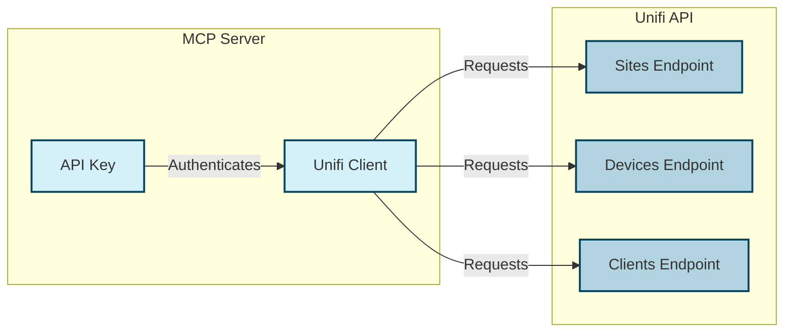

## Data Security Considerations

### API Key Protection

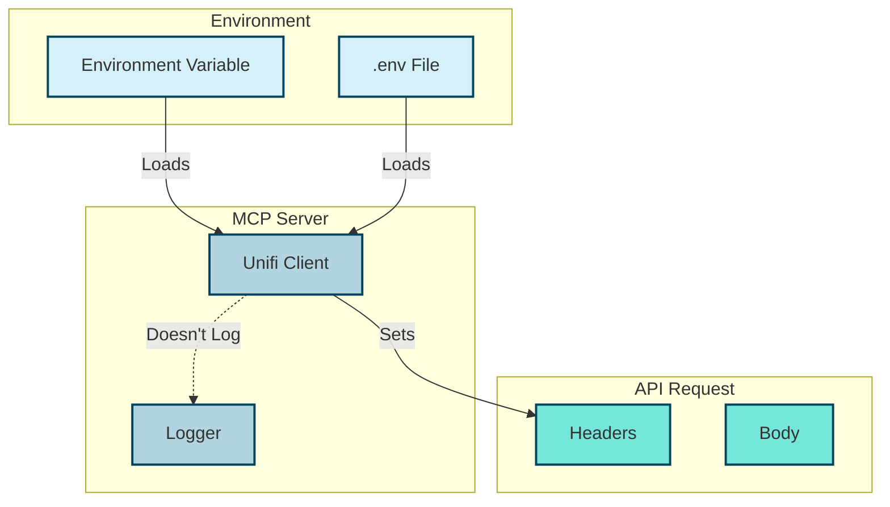

### Data Sanitization

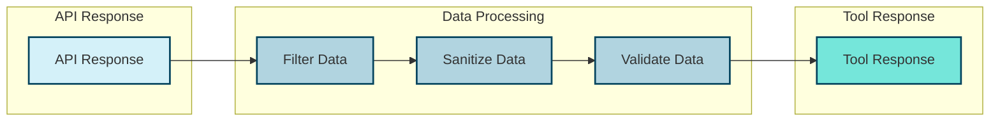

## Conclusion

The data flow architecture of the Unifi MCP Server is designed to efficiently transform natural language requests into structured API calls and convert API responses into user-friendly formats. The system is primarily stateless, with clear data models and transformations at each stage of the process.

Key aspects of the data flow architecture include:

1. **Well-defined Data Models**: Clear input and output models for each tool
2. **Transformation Pipelines**: Structured processes for converting between different data formats
3. **Error Handling**: Comprehensive error detection and reporting
4. **Logging**: Detailed logging throughout the system
5. **Security**: Protection of sensitive data like API keys

This architecture provides a solid foundation for the Unifi MCP Server, enabling it to reliably bridge the gap between natural language interaction and the Unifi Site Manager API.
