# Unifi MCP Server Integration Architecture

This document outlines the integration architecture for the Unifi MCP Server, focusing on how it integrates with Claude Desktop and the Unifi Site Manager API, as well as potential future integrations.

## Integration Overview

The Unifi MCP Server serves as an integration bridge between Claude Desktop and the Unifi Site Manager API, enabling natural language interaction with Unifi network infrastructure.

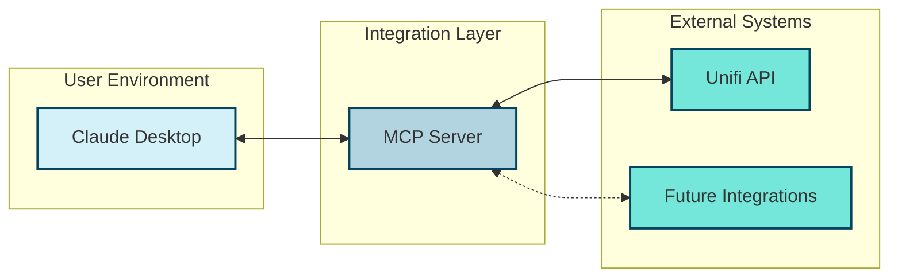

## Integration Patterns

The Unifi MCP Server implements several integration patterns to facilitate communication between systems:

### API Gateway Pattern

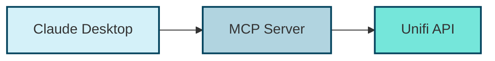

The MCP Server acts as an API Gateway, providing a unified interface for Claude Desktop to access Unifi API functionality. This pattern:

1. **Simplifies Client Integration**: Claude Desktop only needs to understand the MCP protocol
2. **Centralizes Authentication**: Handles API key authentication in one place
3. **Enables Protocol Translation**: Converts between MCP and Unifi API protocols

### Adapter Pattern

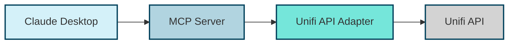

The Unifi Client component implements the Adapter pattern, converting between the MCP Server's internal interface and the Unifi API's interface. This pattern:

1. **Isolates API Dependencies**: Changes to the Unifi API only affect the adapter
2. **Simplifies Testing**: The adapter can be mocked for testing
3. **Enables Multiple Adapters**: Additional adapters can be added for other systems

### Facade Pattern

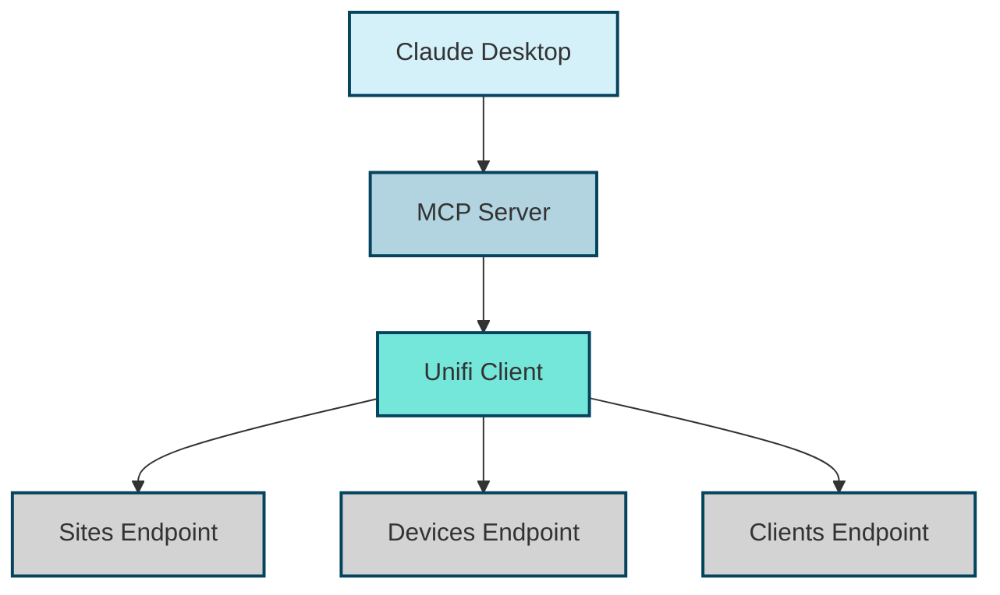

The Unifi Client also implements the Facade pattern, providing a simplified interface to the various Unifi API endpoints. This pattern:

1. **Simplifies Complex APIs**: Provides a unified interface to multiple endpoints
2. **Hides Implementation Details**: Abstracts away the details of API calls
3. **Centralizes Error Handling**: Handles errors consistently across endpoints

## Claude Desktop Integration

### Integration Architecture

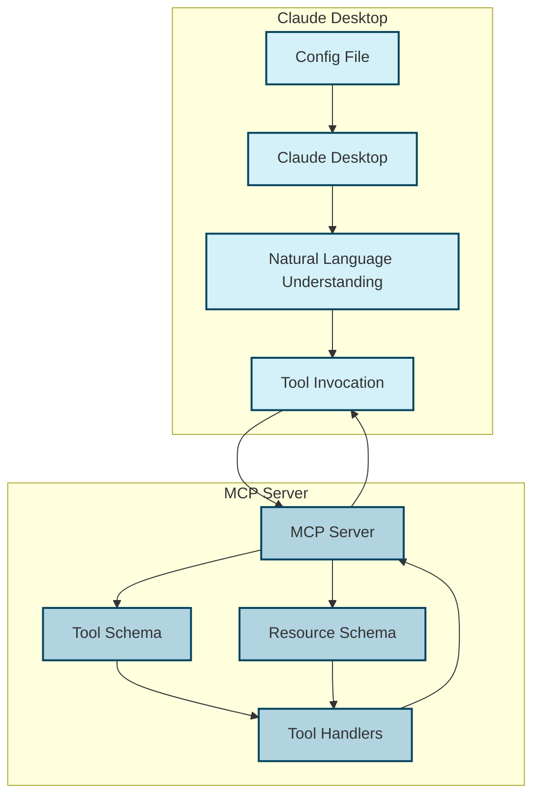

### Configuration Integration

Claude Desktop is configured to connect to the MCP Server through a configuration file:

```json
{
  "mcpServers": {
    "unifi": {
      "command": "/path/to/uv",
      "args": [
        "--directory",
        "/path/to/mcp-server-unifi",
        "run",
        "main.py"
      ]
    }
  }
}
```

This configuration:
1. **Registers the Server**: Tells Claude Desktop about the MCP Server
2. **Specifies Launch Command**: Provides the command to start the server
3. **Names the Server**: Gives the server a name ("unifi") for reference

### Protocol Integration

Claude Desktop communicates with the MCP Server using the Model Context Protocol:

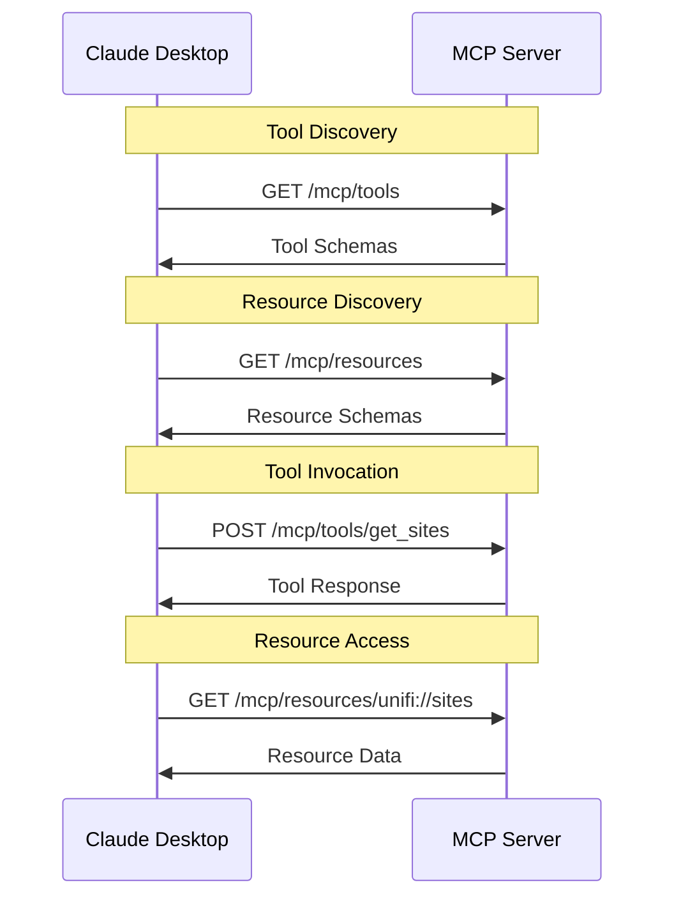

This protocol enables:
1. **Tool Discovery**: Claude Desktop can discover available tools
2. **Resource Discovery**: Claude Desktop can discover available resources
3. **Tool Invocation**: Claude Desktop can invoke tools with parameters
4. **Resource Access**: Claude Desktop can access resources directly

## Unifi API Integration

### Integration Architecture

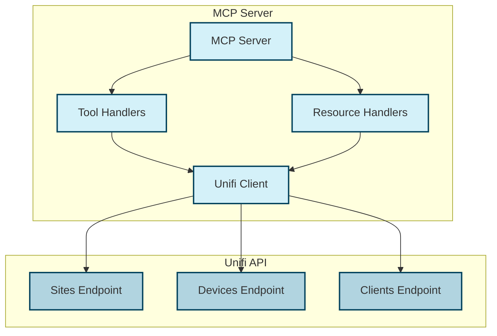

### Authentication Integration

The MCP Server authenticates with the Unifi API using an API key:

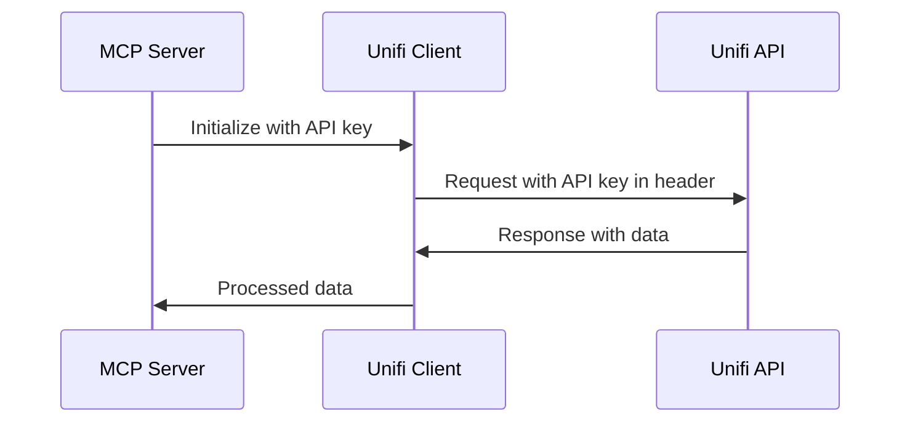

The API key is:
1. **Stored Securely**: In environment variables or .env file
2. **Never Hardcoded**: Not included in the source code
3. **Passed in Headers**: Included in the Authorization header of requests

### Endpoint Integration

The Unifi Client integrates with various Unifi API endpoints:

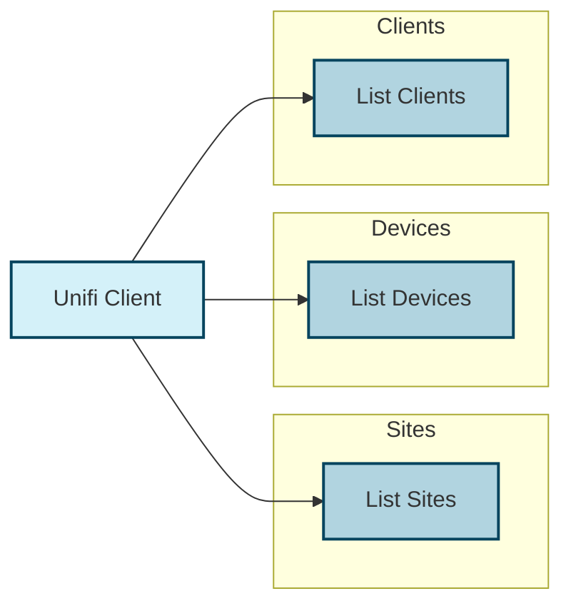

Each endpoint integration:
1. **Maps to a Tool**: Corresponds to an MCP tool
2. **Handles Authentication**: Includes the API key in requests
3. **Processes Responses**: Transforms API responses into tool responses

## Integration Interfaces

### MCP Tool Interface

MCP tools are defined using the `@mcp_server.tool` decorator:

```python
@mcp_server.tool(
    "get_sites",
    GetSitesInput,
    GetSitesOutput,
    "Get a list of all Unifi sites"
)
async def get_sites(input: GetSitesInput) -> GetSitesOutput:
    """Get a list of all Unifi sites"""
    # Implementation
```

This interface:
1. **Defines the Tool Name**: "get_sites"
2. **Specifies Input Model**: GetSitesInput
3. **Specifies Output Model**: GetSitesOutput
4. **Provides Description**: "Get a list of all Unifi sites"
5. **Implements Handler**: The function that handles the tool invocation

### MCP Resource Interface

MCP resources are defined using the `@mcp_server.resource` decorator:

```python
@mcp_server.resource("unifi://sites")
async def resource_sites():
    """Resource for accessing Unifi sites"""
    # Implementation
```

This interface:
1. **Defines the Resource URI**: "unifi://sites"
2. **Implements Handler**: The function that provides the resource data

### Unifi Client Interface

The Unifi Client provides an interface for interacting with the Unifi API:

```python
class UnifiClient:
    """Client for interacting with the Unifi Site Manager API"""
    
    def __init__(self):
        # Initialization
    
    async def get_sites(self) -> List[Dict[str, Any]]:
        """Get list of all Unifi sites"""
        # Implementation
    
    async def get_devices(self, site_id: str) -> List[Dict[str, Any]]:
        """Get list of all devices for a specific site"""
        # Implementation
    
    async def get_clients(self, site_id: str) -> List[Dict[str, Any]]:
        """Get list of all clients for a specific site"""
        # Implementation
```

This interface:
1. **Provides Methods**: For each API endpoint
2. **Handles Authentication**: Manages API key authentication
3. **Processes Responses**: Transforms API responses into usable data

## Integration Extensibility

The Unifi MCP Server is designed to be extensible, allowing for additional integrations in the future.

### Adding New Tools

New tools can be added to integrate with additional Unifi API functionality:

```python
@mcp_server.tool(
    "get_statistics",
    GetStatisticsInput,
    GetStatisticsOutput,
    "Get statistics for a specific site"
)
async def get_statistics(input: GetStatisticsInput) -> GetStatisticsOutput:
    """Get statistics for a specific site"""
    # Implementation
```

Steps to add a new tool:
1. **Define Input/Output Models**: Create Pydantic models for input and output
2. **Implement Unifi Client Method**: Add a method to the Unifi Client
3. **Create Tool Handler**: Implement the tool handler function
4. **Register the Tool**: Use the `@mcp_server.tool` decorator

### Adding New Resources

New resources can be added to provide additional data to Claude Desktop:

```python
@mcp_server.resource("unifi://statistics")
async def resource_statistics():
    """Resource for accessing Unifi statistics"""
    # Implementation
```

Steps to add a new resource:
1. **Implement Unifi Client Method**: Add a method to the Unifi Client
2. **Create Resource Handler**: Implement the resource handler function
3. **Register the Resource**: Use the `@mcp_server.resource` decorator

### Integration with Other Systems

The architecture can be extended to integrate with other systems:

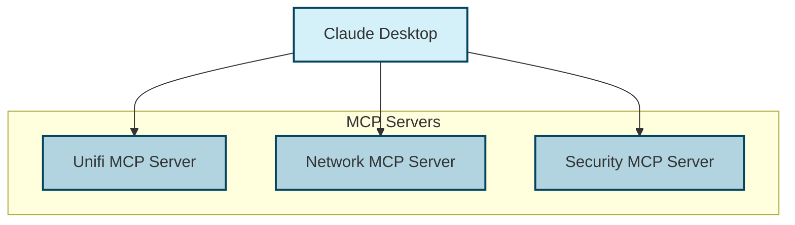

Approaches for multi-system integration:
1. **Multiple MCP Servers**: Create separate MCP servers for each system
2. **Single MCP Server with Multiple Adapters**: Extend one MCP server to support multiple systems
3. **API Aggregation**: Use an API gateway to aggregate multiple APIs

## Enterprise Integration Patterns

For more complex enterprise deployments, additional integration patterns can be implemented:

### Message Queue Integration

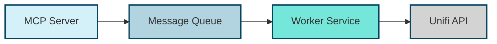

This pattern enables:
1. **Asynchronous Processing**: Decouple request handling from processing
2. **Load Balancing**: Distribute work across multiple workers
3. **Resilience**: Handle temporary API outages

### Event-Driven Integration

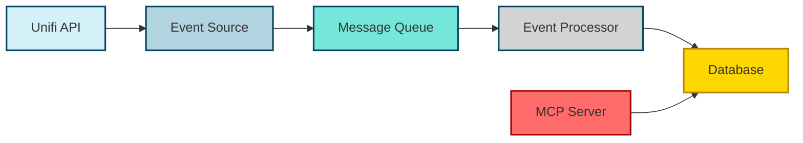

This pattern enables:
1. **Real-time Updates**: React to changes in the Unifi system
2. **Historical Data**: Store event history for analysis
3. **Decoupled Processing**: Process events independently of requests

### API Management Integration

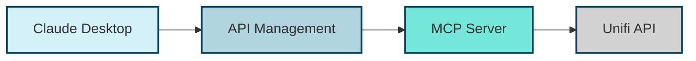

This pattern enables:
1. **Authentication**: Centralized authentication and authorization
2. **Rate Limiting**: Control access rates to the API
3. **Monitoring**: Track API usage and performance
4. **Caching**: Cache responses for improved performance

## Integration Challenges and Solutions

### Challenge: API Changes

**Challenge**: The Unifi API may change over time, breaking integration.

**Solution**:
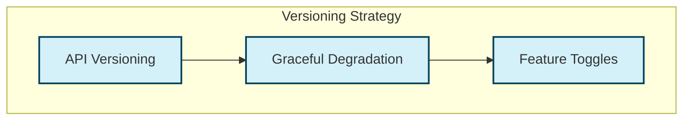

1. **Adapter Layer**: Isolate API-specific code in the Unifi Client
2. **Version Checking**: Check API version before making requests
3. **Graceful Degradation**: Provide limited functionality when features are unavailable
4. **Feature Toggles**: Enable/disable features based on API availability

### Challenge: Authentication

**Challenge**: Managing API keys securely across environments.

**Solution**:
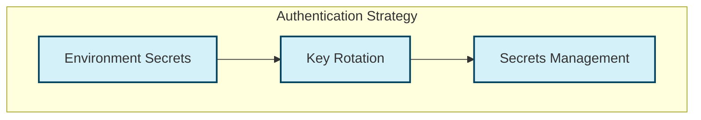

1. **Environment Variables**: Store API keys in environment variables
2. **Secrets Management**: Use a secrets management system for production
3. **Key Rotation**: Regularly rotate API keys
4. **Fallback Mechanisms**: Implement graceful handling of authentication failures

### Challenge: Error Handling

**Challenge**: Handling errors from the Unifi API.

**Solution**:
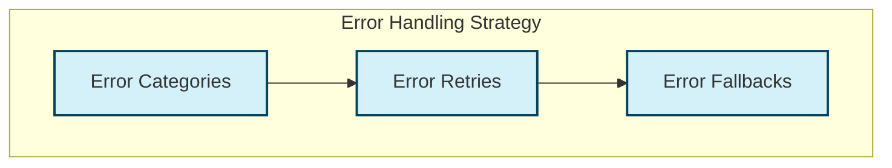

1. **Error Categorization**: Categorize errors (authentication, network, API, etc.)
2. **Retry Mechanism**: Implement retries for transient errors
3. **Circuit Breaker**: Prevent cascading failures
4. **Fallback Responses**: Provide useful responses even when the API fails

## Integration Testing

### Testing Strategy

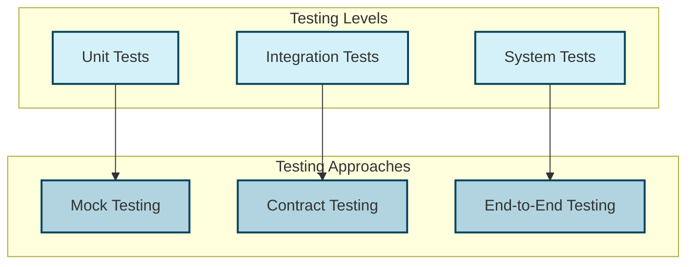

1. **Unit Testing**: Test individual components in isolation
   - Mock the Unifi Client for tool handler tests
   - Mock the Unifi API for Unifi Client tests

2. **Integration Testing**: Test component interactions
   - Test MCP Server with Unifi Client
   - Test Unifi Client with a mock API

3. **System Testing**: Test the entire system
   - Test with Claude Desktop
   - Test with the actual Unifi API

### Testing Tools

1. **Mock Testing**: Use Python's `unittest.mock` or `pytest-mock`
2. **API Mocking**: Use tools like `responses` or `httpx.MockTransport`
3. **Contract Testing**: Define and test against API contracts
4. **End-to-End Testing**: Test the complete flow with real systems

## Conclusion

The integration architecture of the Unifi MCP Server provides a robust foundation for connecting Claude Desktop with the Unifi Site Manager API. By implementing established integration patterns and providing clear interfaces, the architecture enables natural language interaction with Unifi network infrastructure while maintaining flexibility for future extensions.

Key aspects of the integration architecture include:

1. **Integration Patterns**: API Gateway, Adapter, and Facade patterns
2. **Clear Interfaces**: Well-defined interfaces for tools, resources, and API clients
3. **Extensibility**: Support for adding new tools, resources, and system integrations
4. **Enterprise Patterns**: Options for more complex enterprise integrations
5. **Testing Strategy**: Comprehensive approach to testing integrations

This architecture provides a solid foundation for the Unifi MCP Server, enabling it to reliably bridge the gap between natural language interaction and Unifi network management.