# Unifi MCP Server Security Architecture

This document outlines the security architecture for the Unifi MCP Server, including authentication, authorization, data protection, and security best practices.

## Security Overview

The Unifi MCP Server handles communication between Claude Desktop and the Unifi Site Manager API, requiring careful attention to security at multiple levels. This document details the security measures implemented throughout the system.

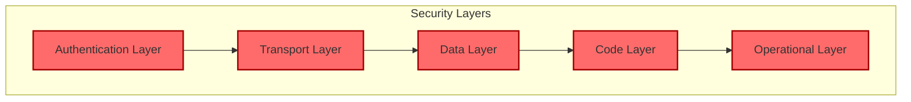

## Authentication and Authorization

### API Key Authentication

The primary authentication method for the Unifi MCP Server is API key authentication with the Unifi Site Manager API.

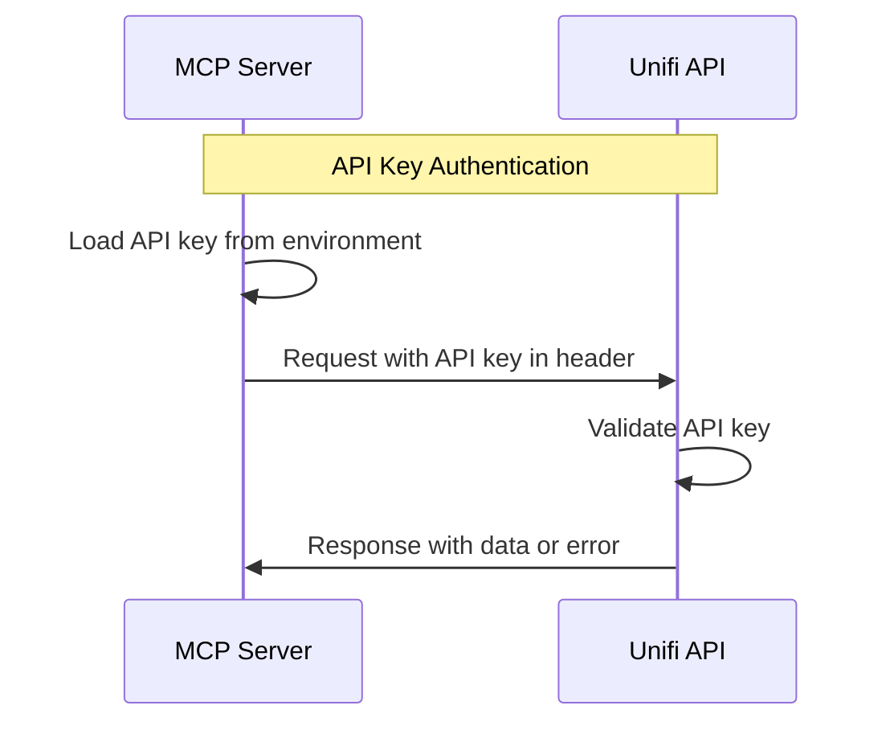

#### API Key Storage

The API key is stored securely using environment variables:

1. **Environment Variable**: The API key is stored in the `UNIFI_API_KEY` environment variable
2. **`.env` File**: For development and local deployment, the API key can be stored in a `.env` file (not committed to version control)
3. **Docker Secrets**: For Docker deployment, the API key can be passed as an environment variable or using Docker secrets

#### API Key Security Measures

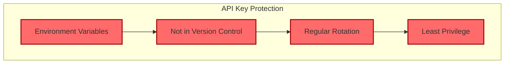

1. **Environment Variables**: API keys are stored in environment variables, not hardcoded
2. **Not in Version Control**: `.env` files are excluded from version control via `.gitignore`
3. **Regular Rotation**: API keys should be rotated regularly (recommended quarterly)
4. **Least Privilege**: API keys should have the minimum necessary permissions

### Enterprise OAuth Integration (Optional)

For enterprise deployments, OAuth 2.0 authentication can be implemented using Azure API Management and Entra ID.

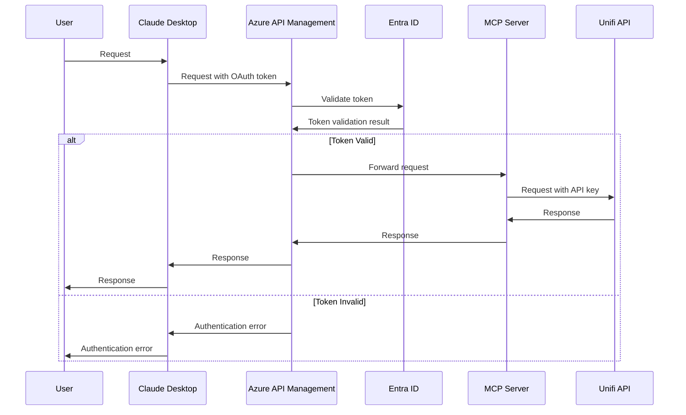

#### OAuth Security Considerations

1. **Token Expiration**: Short-lived access tokens (1 hour or less)
2. **Scope Control**: Limit token scopes to necessary operations
3. **Refresh Tokens**: Secure handling of refresh tokens
4. **Client Validation**: Validate client applications

## Transport Security

### HTTPS/TLS

All communication between components should use HTTPS/TLS:

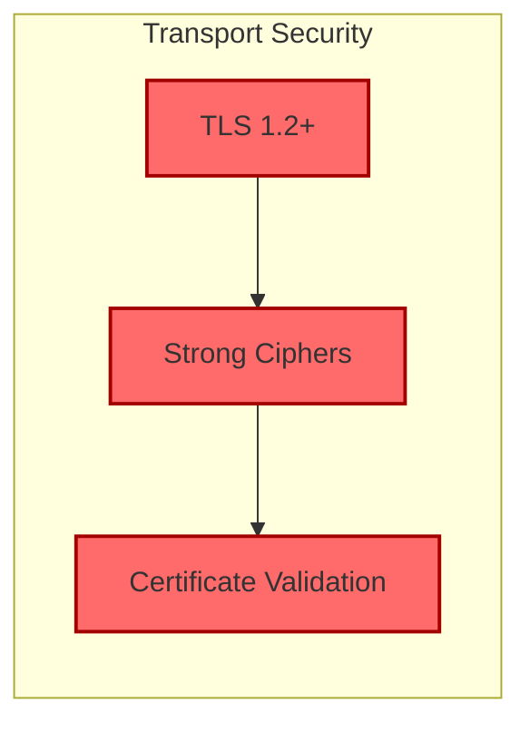

1. **TLS Version**: Use TLS 1.2 or higher
2. **Cipher Suites**: Use strong cipher suites
3. **Certificate Validation**: Properly validate certificates
4. **HSTS**: Consider implementing HTTP Strict Transport Security

### Local Communication

For local deployment, the MCP Server communicates with Claude Desktop over localhost:

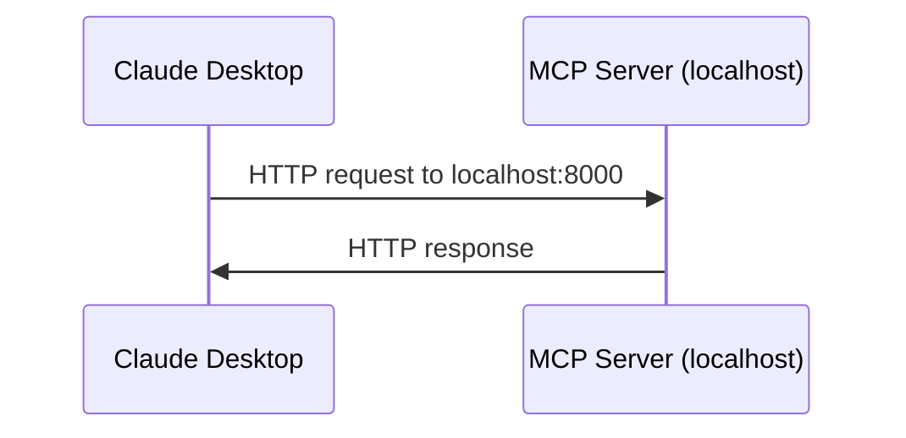

While this communication is not encrypted, it stays within the local machine, reducing the risk of interception.

## Data Protection

### Sensitive Data Handling

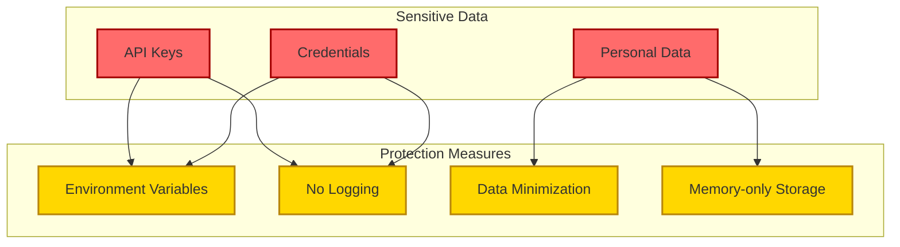

1. **API Keys**: Stored in environment variables, never logged
2. **Credentials**: Not stored in the application
3. **Personal Data**: Minimized and not persisted

### Data Minimization

The MCP Server implements data minimization by:

1. **Filtering Responses**: Only returning necessary data fields
2. **No Persistent Storage**: Not storing API responses
3. **Temporary Processing**: Processing data in memory only

### Error Messages

Security considerations for error handling:

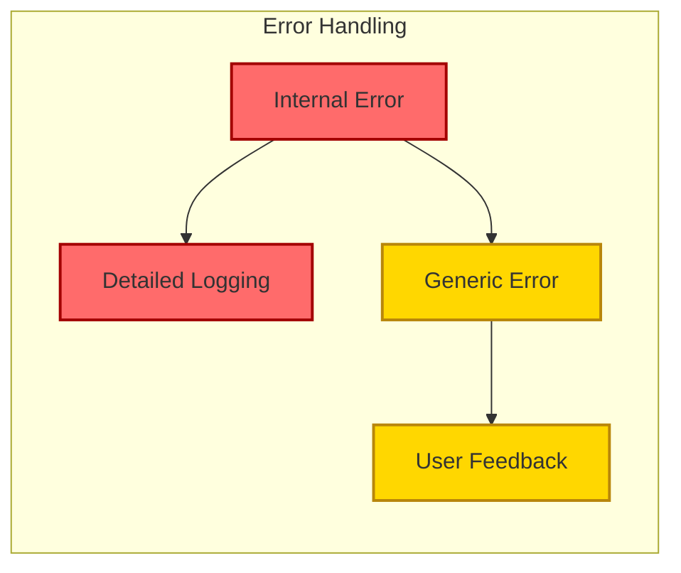

1. **Detailed Internal Logging**: Log detailed error information for debugging
2. **Generic External Messages**: Return generic error messages to users
3. **No Sensitive Information**: Ensure error messages don't contain sensitive information

## Code Security

### Input Validation

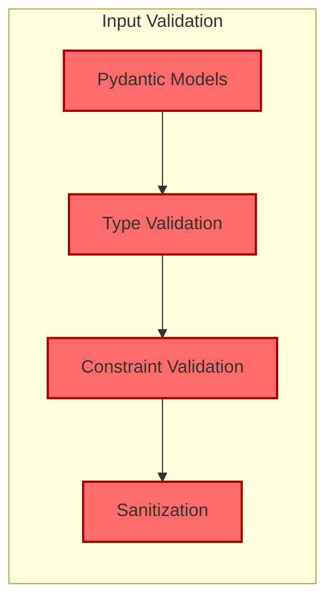

1. **Pydantic Models**: Use Pydantic for input validation
2. **Type Checking**: Validate data types
3. **Constraints**: Enforce data constraints
4. **Sanitization**: Sanitize inputs before processing

### Dependency Security

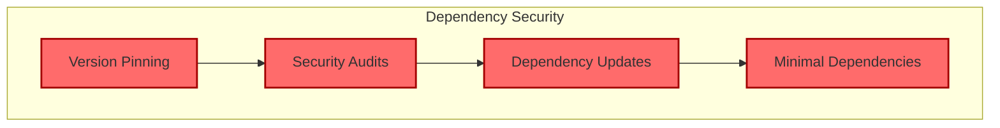

1. **Version Pinning**: Pin dependency versions
2. **Security Audits**: Regularly audit dependencies for vulnerabilities
3. **Regular Updates**: Keep dependencies updated
4. **Minimal Dependencies**: Use only necessary dependencies

## Operational Security

### Logging and Monitoring

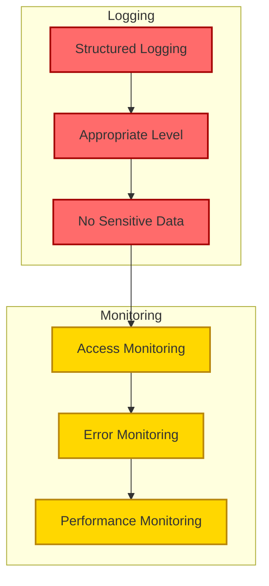

1. **Structured Logging**: Use structured logging format
2. **Appropriate Log Levels**: Use appropriate log levels (INFO, DEBUG, ERROR)
3. **No Sensitive Data**: Don't log sensitive information
4. **Access Monitoring**: Monitor access to the API
5. **Error Monitoring**: Monitor and alert on errors
6. **Performance Monitoring**: Monitor performance metrics

### Docker Security

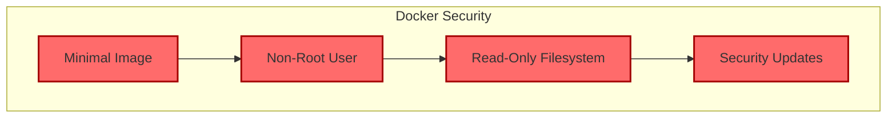

1. **Minimal Base Image**: Use minimal base image (python:3.10-slim)
2. **Non-Root User**: Run as non-root user (future enhancement)
3. **Read-Only Filesystem**: Use read-only filesystem where possible (future enhancement)
4. **Security Updates**: Regularly update the Docker image

## Security Threat Model

### Threat Actors

Potential threat actors for the Unifi MCP Server:

1. **External Attackers**: Attempting to gain unauthorized access
2. **Malicious Users**: Authorized users attempting to access unauthorized data
3. **Insider Threats**: Internal users with legitimate access
4. **Automated Attacks**: Bots and automated scanning tools

### Attack Vectors

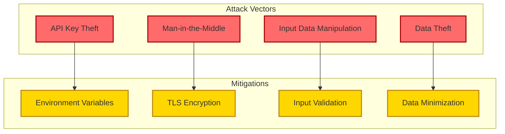

1. **API Key Theft**: Unauthorized access to API keys
   - **Mitigation**: Secure storage, regular rotation, least privilege

2. **Man-in-the-Middle Attacks**: Intercepting communication
   - **Mitigation**: TLS encryption, certificate validation

3. **Input Data Manipulation**: Manipulating input data
   - **Mitigation**: Input validation, sanitization

4. **Data Theft**: Unauthorized access to data
   - **Mitigation**: Data minimization, no persistent storage

### STRIDE Analysis

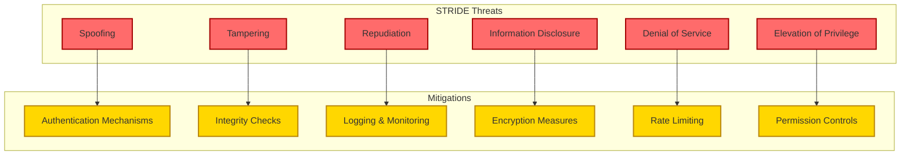

#### Spoofing

**Threat**: Impersonating another user or system component

**Mitigations**:
- API key authentication
- OAuth integration for enterprise deployments
- Proper certificate validation

#### Tampering

**Threat**: Unauthorized modification of data

**Mitigations**:
- Input validation
- TLS encryption
- Integrity checks

#### Repudiation

**Threat**: Denying actions without verification

**Mitigations**:
- Comprehensive logging
- Audit trails
- Request IDs

#### Information Disclosure

**Threat**: Unauthorized access to information

**Mitigations**:
- Data minimization
- No persistent storage
- Proper error handling

#### Denial of Service

**Threat**: Making the system unavailable

**Mitigations**:
- Rate limiting (future enhancement)
- Timeouts for external requests
- Resource limits

#### Elevation of Privilege

**Threat**: Gaining higher privileges than authorized

**Mitigations**:
- Principle of least privilege
- Input validation
- Proper error handling

## Security Best Practices

### API Key Management

1. **Secure Storage**: Store API keys in environment variables or secure storage
2. **Regular Rotation**: Rotate API keys regularly (quarterly recommended)
3. **Least Privilege**: Use API keys with minimal necessary permissions
4. **Revocation Plan**: Have a plan for revoking compromised API keys

### Secure Coding Practices

1. **Input Validation**: Validate all inputs
2. **Output Encoding**: Properly encode outputs
3. **Error Handling**: Implement proper error handling
4. **Dependency Management**: Keep dependencies updated
5. **Code Reviews**: Conduct security-focused code reviews

### Deployment Security

1. **Environment Separation**: Separate development, testing, and production environments
2. **Configuration Management**: Securely manage configuration
3. **Secrets Management**: Use proper secrets management
4. **Least Privilege**: Run services with minimal necessary permissions
5. **Regular Updates**: Keep all components updated

## Security Roadmap

Future security enhancements for the Unifi MCP Server:

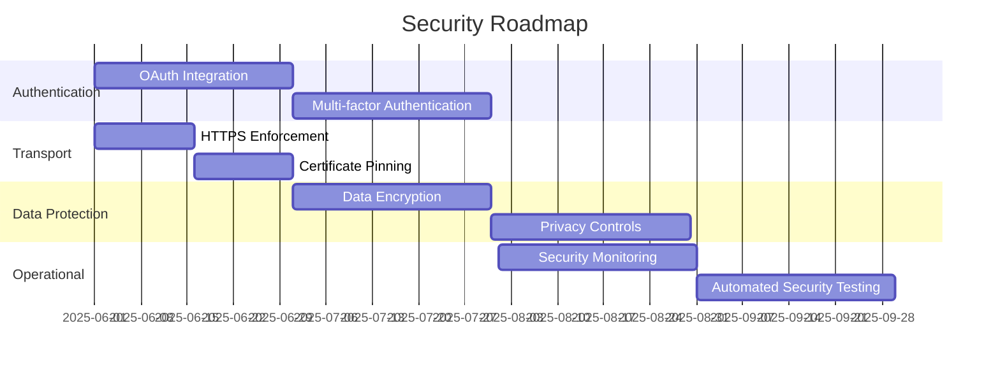

1. **Enhanced Authentication**:
   - OAuth integration
   - Multi-factor authentication

2. **Transport Security**:
   - HTTPS enforcement
   - Certificate pinning

3. **Data Protection**:
   - Data encryption
   - Enhanced privacy controls

4. **Operational Security**:
   - Security monitoring and alerting
   - Automated security testing

## Security Compliance Considerations

For enterprise deployments, consider the following compliance frameworks:

1. **GDPR**: For handling personal data of EU residents
2. **HIPAA**: For healthcare-related deployments
3. **SOC 2**: For service organizations
4. **ISO 27001**: For information security management

## Conclusion

The security architecture of the Unifi MCP Server is designed to protect the system at multiple layers, from authentication and transport security to data protection and operational security. By implementing these security measures, the system can safely bridge the gap between Claude Desktop and the Unifi Site Manager API.

Key security aspects include:

1. **Secure Authentication**: API key authentication with secure storage and handling
2. **Transport Security**: TLS encryption for all external communications
3. **Data Protection**: Data minimization and no persistent storage of sensitive data
4. **Code Security**: Input validation, dependency management, and secure coding practices
5. **Operational Security**: Proper logging, monitoring, and deployment security

This security architecture provides a solid foundation for the Unifi MCP Server, enabling it to operate securely in various deployment scenarios, from personal use to enterprise environments.
